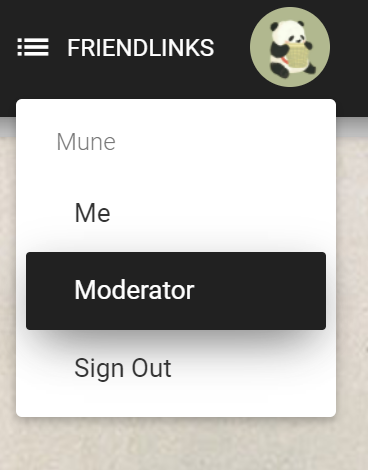
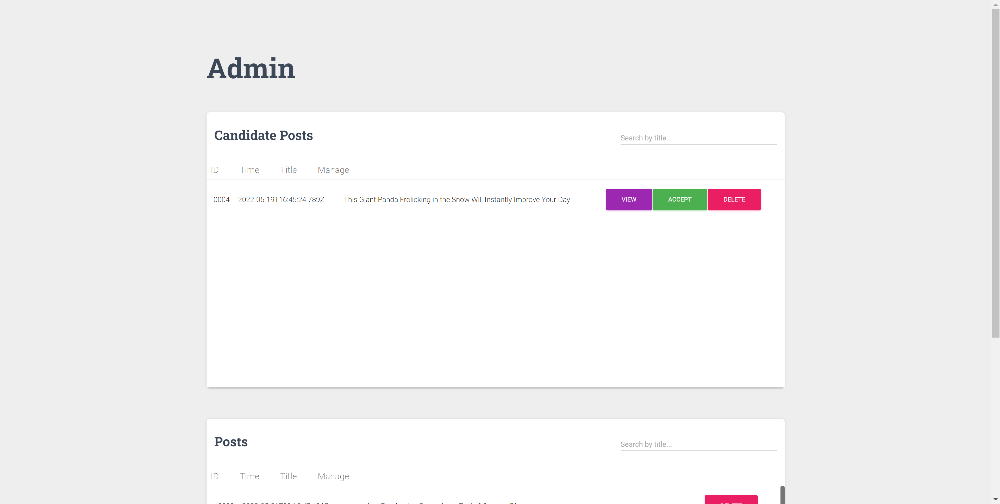

# 保护熊猫论坛系统
:yum: 基于 Vue + vuex + vue-router + express + vue material kit 开发的一个动物保护论坛项目
这是一个课程项目，具体有以下需求：
1.主页能放视频，有相关熊猫的介绍并且有链接能跳转到论坛界面。
2.未登录的用户只能看帖，不能发帖和评论
3.登录了的用户能发帖和评论
4.用户发的帖子需要管理员确认后才显示在页面上。
5.管理员能够删除帖子


## 预览

#### 主页


#### 帖子页面


#### 帖子详情


#### 登录界面


#### 管理员界面（登录账号：Admin,密码:123456）



#### 其他界面欢迎探索...

#### 技术栈

**前端**

* `Vue`：用于构建用户界面的 MVVM 框架
* `vue-router`：为单页面应用提供的路由系统
* `vuex`：Vue 集中状态管理，用来保存登录状态和登录的用户信息，便于多个组件共享
* `vue material`:Vue组件库


**后端**

* `Express`：基于Node.js平台的Web开发框架，本项目使用Express进行后端的开发
* `Multer`：node.js中间件，用于处理multipart/form-data类型的表单数据，本项目中主要用于上传文件
* `bcrypt`: 密码加密
* `cookie-parser`:解析cookie


**其他工具**

* `sqllite`: 用于连接和操作sqllite数据库
* `vue-cli`：Vue 脚手架工具，快速初始化项目代码
* `eslint`：代码风格检查工具
* `prettier` ：自动格式化代码


## 最后

做的很急，有时间会重新写一下，欢迎交流！

## Build Setup
```bash
# install dependencies
npm install

# serve with hot reload at localhost:8080
npm run serve

# build for production with minification
npm run build
```
## Backend
```bash

cd server

node app.js
```